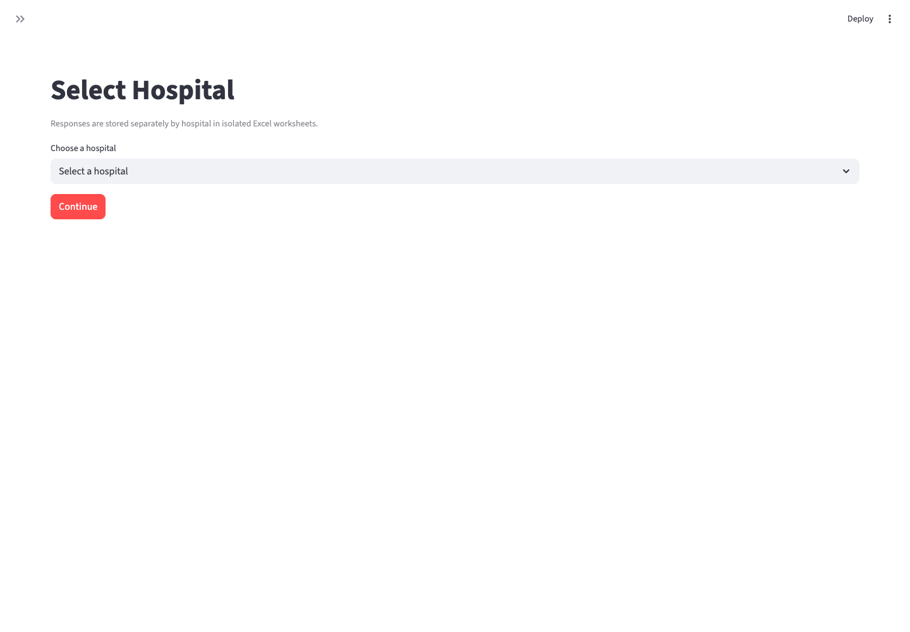
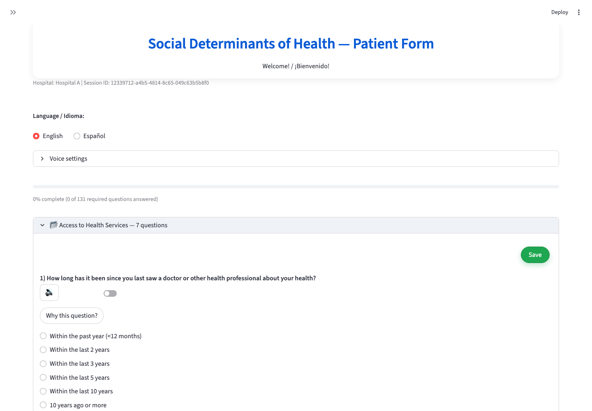
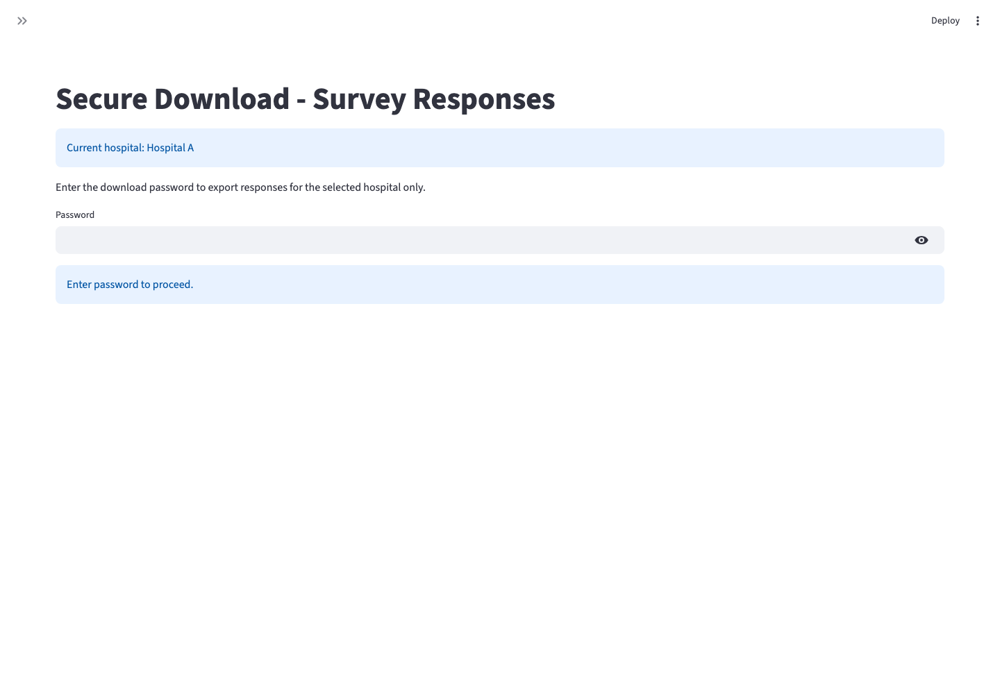

# SDoHv4

SDoHv4 is a Streamlit research prototype for collecting Social Determinants of
Health (SDoH) survey responses in English or Spanish. The app presents a
branching, section-based questionnaire, supports voice input/output, saves
partial or completed responses, and keeps response exports separated by
selected hospital.

This repository is intended for research testing and expert review. It is not a
clinical decision support tool and should not be used for production clinical
workflows until the questionnaire, translations, data handling, privacy model,
and administrative access controls have been formally reviewed.

## Project links

- GitHub repository: [https://github.com/tigee1311/SDoHv4](https://github.com/tigee1311/SDoHv4)
- Hosted SDoH questionnaire app: [https://sdohchatbot.streamlit.app/](https://sdohchatbot.streamlit.app/)
- Deployment package for cloud handoff: `SDoHv4-deploy.zip`
- Hospital selection screenshot: [docs/screenshots/hospital-selection.png](docs/screenshots/hospital-selection.png)
- Survey workflow screenshot: [docs/screenshots/survey-workflow.png](docs/screenshots/survey-workflow.png)
- Admin/download workflow screenshot: [docs/screenshots/admin-download.png](docs/screenshots/admin-download.png)

## SDoH reference links

- Healthy People 2030 SDoH overview: [https://odphp.health.gov/healthypeople/priority-areas/social-determinants-health](https://odphp.health.gov/healthypeople/priority-areas/social-determinants-health)
- CDC SDoH overview: [https://www.cdc.gov/public-health-gateway/php/about/social-determinants-of-health.html](https://www.cdc.gov/public-health-gateway/php/about/social-determinants-of-health.html)
- WHO SDoH topic page: [https://www.who.int/topics/health_equity/en/](https://www.who.int/topics/health_equity/en/)

## Screenshots

Hospital selection:



Survey workflow:



Admin/download workflow:



## What the questionnaire does

- Guides patients or research participants through a bilingual SDoH
  questionnaire.
- Groups questions into domains such as access to care, income, food security,
  insurance, health literacy, demographics, discrimination, housing,
  transportation, financial strain, social support, work, environment,
  community resilience, tobacco, alcohol, and digital access.
- Uses branching logic so follow-up questions appear only when relevant.
- Shows progress based on required visible questions.
- Lets users save each section independently with a sticky section save button.
- Provides a bottom-right SDoH FAQ chat control that matches user questions to
  local reviewed answers.
- Saves completed surveys as a separate final submission.
- Stores responses in an Excel workbook, with one isolated worksheet per
  hospital.
- Provides a password-gated download page for hospital-specific CSV and Excel
  exports.

## Features implemented

- 91-question bilingual question bank with English and Spanish labels.
- Section expanders with partial save support.
- Global English/Spanish language selector.
- Browser microphone capture through Streamlit `audio_input` when available.
- Speech-to-text transcription through `SpeechRecognition` for compatible WAV
  browser audio.
- Text-to-speech playback with `gTTS`.
- "Why this question?" explanations maintained separately in
  `explanations.py`.
- Local FAQ matching in `faq_chatbot.py` using `faq_answers.json`. The FAQ
  library excludes yellow-highlighted rows from the review document and omits
  `FAQ-093` onward.
- Per-hospital Excel persistence in `storage.py`.
- Hospital-specific downloads gated by `SDOH_DOWNLOAD_PASSWORD`.
- Disabled-by-default Google Drive upload placeholder that reports status but
  does not upload files.

## What still needs expert review

- Clinical and research validity of the full questionnaire.
- Whether the question wording, branching logic, and required/optional rules
  match the intended study protocol.
- Spanish translations, health literacy level, and cultural appropriateness.
- Whether demographic, SDoH, tobacco, alcohol, and discrimination questions
  require consent language or additional participant protections.
- Scoring, derived variables, and interpretation of collected responses.
- HIPAA/privacy posture before collecting identifiable or protected health
  information.
- IRB, consent, retention, audit logging, and access-control requirements.
- Admin workflow design, including role-based access and hospital onboarding.
- Production storage. The current Excel workbook is suitable only for
  prototype/research testing.
- Google Drive or other cloud export behavior. The current Drive integration is
  intentionally a placeholder and does not upload files.

## Hospital and admin selection

The app currently exposes four placeholder hospital choices:

- `Hospital A`
- `Hospital B`
- `Hospital C`
- `Hospital D`

On first load, the user must choose a hospital before entering the survey. That
hospital name is stored in Streamlit session state along with a random
anonymous session ID. All partial and final saves for that session are written to
the selected hospital's worksheet inside `sdoh_responses.xlsx`.

The sidebar includes a navigation control with two pages:

- `Survey`: participant-facing questionnaire.
- `Download Responses`: admin/export page.

The download page prompts for hospital selection if none is active, then
requires the configured `SDOH_DOWNLOAD_PASSWORD`. After the password is
accepted, the page exports only the currently selected hospital's worksheet as
CSV or Excel. There is no full role-based admin system yet; the password gate
is a prototype control and needs security review before real deployment.

## Local setup

Use Python 3.10 or newer. Python 3.11 is recommended for deployment parity.

```bash
git clone https://github.com/tigee1311/SDoHv4.git
cd SDoHv4

python3 -m venv .venv
source .venv/bin/activate

python -m pip install --upgrade pip
python -m pip install -r requirements.txt
```

Run the app:

```bash
streamlit run app.py
```

Open the local Streamlit URL shown in the terminal. If using voice input, allow
microphone access in the browser.

## Configuration

The app works without additional credentials for the basic survey and Excel
persistence flow. Optional environment variables enable additional behavior:

| Variable | Purpose |
| --- | --- |
| `SDOH_DOWNLOAD_PASSWORD` | Enables the password-gated hospital export page. |
| `SDOH_RESPONSE_WORKBOOK` | Overrides the default local workbook path `sdoh_responses.xlsx`. |
| `GOOGLE_DRIVE_FOLDER_ID` | Future Drive upload target. Currently status-only. |
| `GOOGLE_SERVICE_ACCOUNT_JSON` | Future Drive credentials. Currently status-only. |
| `GOOGLE_APPLICATION_CREDENTIALS` | Future Drive credential file path. Currently status-only. |

Example:

```bash
export SDOH_DOWNLOAD_PASSWORD="change-me"
export SDOH_RESPONSE_WORKBOOK="./local_sdoh_responses.xlsx"
streamlit run app.py
```

For Streamlit Community Cloud, set secrets through the app settings rather than
committing `.streamlit/secrets.toml`.

## Data storage and privacy

By default, responses are written to `sdoh_responses.xlsx` in the project
directory. This file is intentionally ignored by Git because it may contain
research participant responses.

Each save appends rows with:

- timestamp
- hospital name
- anonymous session ID
- save ID
- save status (`partial` or `completed`)
- completion percentage
- language
- instrument name
- category
- question IDs and text
- response labels and response codes

For clinical or regulated use, replace workbook persistence with an
authenticated database, encryption, audit logs, backups, retention controls,
and formal access management.

## Fresh-clone smoke check

From a clean checkout:

```bash
python -m py_compile app.py drive_upload.py explanations.py language_manager.py storage.py voice_input.py voice_output.py
streamlit run app.py --server.headless true
```

The app should start without import errors, show the hospital selection screen,
allow a hospital choice, render the survey, and create the configured response
workbook only after a save action.

## Repository layout

```text
app.py                 Streamlit UI and questionnaire flow
faq_chatbot.py         Local reviewed-answer FAQ matcher and floating chat UI
faq_answers.json       Approved FAQ answer library used by the chatbot
storage.py             Hospital-isolated Excel persistence and exports
language_manager.py    English/Spanish UI text helpers
explanations.py        "Why this question?" explanation text
voice_input.py         Browser audio capture and transcription helpers
voice_output.py        Text-to-speech helper
drive_upload.py        Disabled-by-default Drive upload placeholder
requirements.txt       Runtime Python dependencies
runtime.txt            Recommended Python runtime for hosted deployment
```

## Notes for deployment

The current hosted app is expected to update when `main` is pushed to GitHub if
it is connected through Streamlit Community Cloud. Configure secrets in the
hosting provider, not in the repository.
